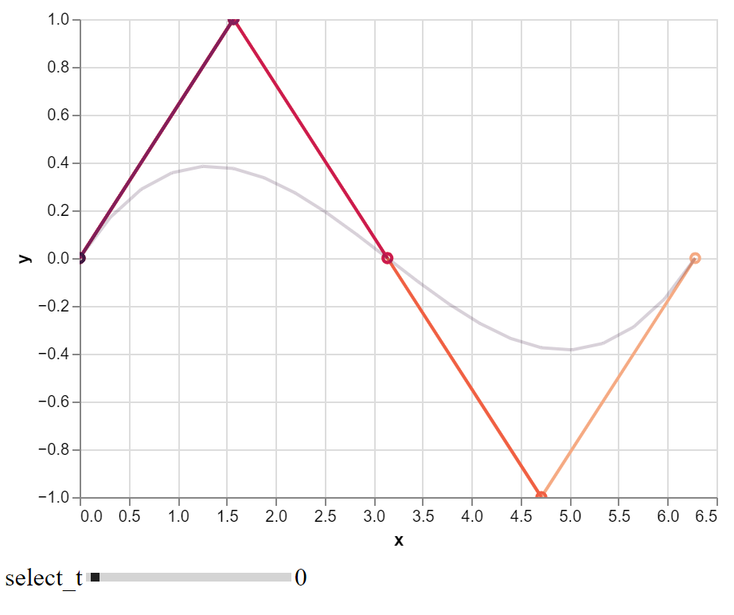
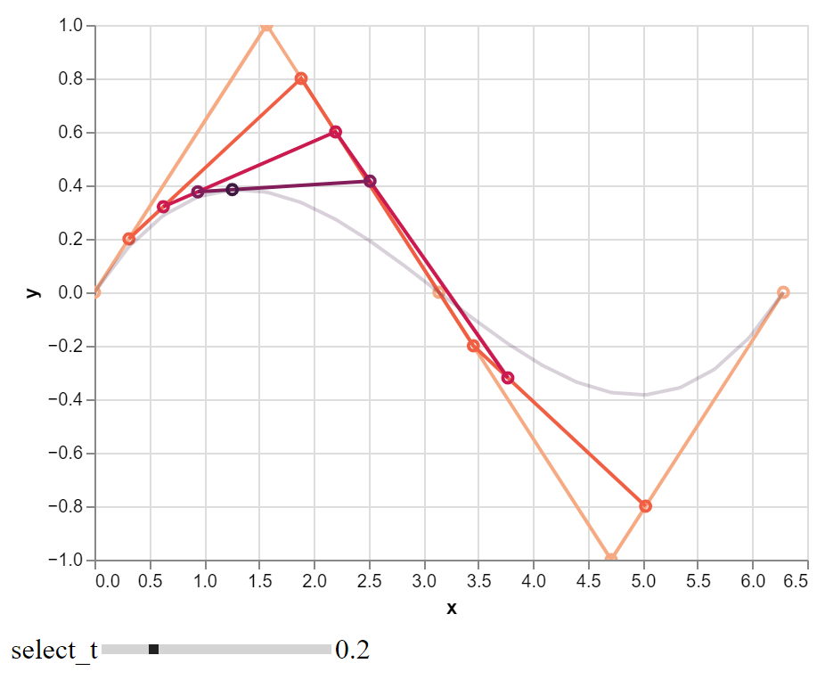
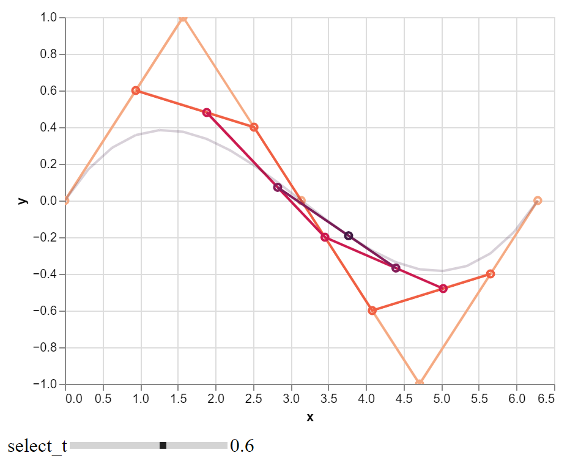

# AnimatedBezierCurve
Produces an interactive "animated" altair chart of a bezier curve saved as a html

## Tutorial
All you have to do is call the "animate_bezier" function in "animate.py".

It will then save a .html of the altair chart to the specified download path (set to the system downloads folder as default).

The chart is interactive so you can move the grid/chart and zoom in/out with the mouse wheel.

You can step through the parametric t values by using the slider at the bottom to "animate" the curve.

### Import steps
1) git clone the repository.
2) type: pip install e . in the directory.
3) in python type: from animate_bezier.animate import animate_bezier

## Example
The anime_bezier function has the following function header:

animate_bezier(
    xs: np.ndarray,
    ys: np.ndarray,
    step: float,
    filename: str = "bezier",
    download_folder: str = expanduser("~") + "/Downloads/",
)

- xs: A numpy array of the x values
- ys: A numpy array of the y values
- step: A float of the parametric t/time interval step value
- filename: A string of the filename the html chart should be stored under (default is "bezier")
- download_folder: A string of the directory location for the html chart to be stored (default is downloads folder)

Below is an example of a cos graph defined by 5 points.

We step through the sequence using the slider at that bottom. This will move through the parametric t/time values.

The html file can be found in the examples folder or by clicking this link: [cos_graph.html](examples/cos_graph.html)

